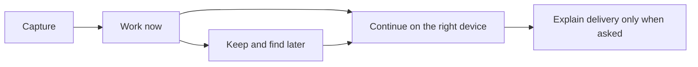
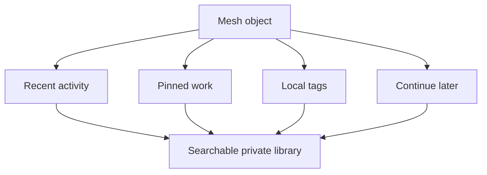
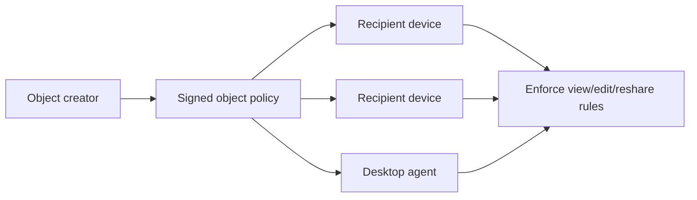

# Where ScreenMesh Can Go

ScreenMesh already has the hard foundation: trusted device identities, encrypted delivery, offline queues, collaborative objects, capability routing, and more than one transport path.

The next work should make that foundation feel more useful to a person—not merely make the network more complicated.

## The near-term product direction



The sequence matters:

1. Make ordinary cross-device work feel effortless.
2. Make valuable objects easy to find and reopen.
3. Make the right destination easy to choose.
4. Add stronger control only when it is genuinely enforced.

## 1. Better object surfaces

The long-term differentiator is not the send button. It is what happens after an object arrives.

### Dedicated document workspace

Documents should open in a focused full-page editor with a title, clear save/sync state, and “continue on” actions. The current collaborative document object is the correct foundation; the next step is making the editing experience feel intentional rather than modal.

Useful additions:

- Rename a document after creation.
- Show who last updated it and when.
- Preserve a local revision trail or restore point.
- Show a quiet sync indicator: saved locally, syncing, or all changes delivered.
- Let the user open a document directly from a “continue later” list.

### Richer viewers, not bloated editors

Images should feel good to preview; code should remain easy to copy; links should be quick to open; files should clearly show their filename, size, and origin. ScreenMesh does not need to become Photoshop, VS Code, or a drive. It should make handoffs immediately useful and hand off to specialist apps when appropriate.

## 2. A personal knowledge layer

Library should gradually replace the pile of “I sent that to myself somewhere” habits.



The first useful enhancements are small:

- Saved searches or lightweight collections.
- Better text/content search as the local object count grows.
- A “resume” area in Workspace for pinned or continued objects.
- Optional local reminders for expiring or unfinished objects.

Keep organization local by default. A person’s pin, tag, and reading state should not unexpectedly reorganize another device’s library.

## 3. Universal capture

The fastest ScreenMesh action should be: “put this in my private mesh.”

The web app already has clipboard capture. Future native/browser integrations can extend it thoughtfully:

- Share-sheet actions for text, links, images, and files.
- A browser extension for the current page or selected text.
- A desktop shortcut for clipboard, screenshot, or current file.
- An Android share target.

Every capture should still land in the normal composer first. The user should see the content, destination, expiry, and approval settings before it is sent. Convenience should never become invisible forwarding.

## 4. Smarter handoff, always user-controlled

Capability routing is already a useful primitive. The product can turn it into better guidance.

| Object | Helpful suggestion |
| --- | --- |
| Code or command | A paired device advertising a terminal |
| Link | A browser-capable device |
| Image or presentation note | A tablet or display |
| Checklist | A phone or tablet |
| File | A device advertising filesystem access |

Suggestions should state the reason and remain one tap to accept. They must never override an explicit recipient choice.

## 5. Object lifecycle that feels understandable

The capability already exists; the language can become more human:

- Keep until I remove it
- Expire in 10 minutes
- Expire tonight
- Delete from the recipient device after opening
- Ask the recipient to accept first

Future work could add object-level lifecycle visibility: when it will expire, where it is queued, and whether it was opened. The important caveat remains: expiry manages ScreenMesh copies, not data a recipient already copied outside ScreenMesh.

## 6. Enforced sharing controls

Permissions are valuable only when they are real. A disabled-looking Edit button is not a security feature.

Before exposing permissions as product controls, the protocol needs an explicit, authenticated object policy that every client enforces.



Possible future policy values:

- Collaborative: trusted recipients can edit.
- View-only: recipients can read but client does not offer edits or reshare.
- Sender-controlled: creator can issue a signed delete/revoke-everywhere operation.
- Reshare allowed or blocked.

Even then, it cannot prevent screenshots, exports, or copies made by a device allowed to view the content. The UI must say this plainly.

## 7. A calmer and more useful Inspect layer

Transfers, Activity, Mesh, and Security should remain available but never become a noisy monitoring dashboard.

The valuable next step is better explanations:

```text
Payload queued

Why?
Nidhi’s Laptop is offline.

What ScreenMesh will do
Keep an encrypted bundle on this device and retry when a trusted route opens.
```

For technical users, a detail panel can show route change, transport, timestamps, and encrypted-bundle state. The default should stay human: what happened, why, and what will happen next.

## 8. Security and protocol directions

These are deeper investments, worth doing only when the product need justifies their extra complexity.

### Stronger offline session bootstrap

The current pairwise ratchet design is a strong practical baseline. Published one-time prekey bundles would improve the forward-secrecy story before a pair’s first round trip, but require careful server-side prekey lifecycle handling.

### Group encryption for larger workspaces

Pairwise sessions are straightforward and appropriate for a small personal mesh. If workspaces grow, an MLS-style group protocol may become attractive, but it would be a major protocol change and should not be adopted merely for novelty.

### Relay metadata hardening

Relays do not need plaintext, but they can still observe routing metadata such as timing, size, and device connectivity. Reducing that visibility is possible, but expensive in latency, complexity, and bandwidth. It is a future privacy goal, not a claim ScreenMesh makes today.

### Capability verification

Capabilities are currently self-reported by already trusted devices. A future capability attestation model could give higher confidence that a terminal, filesystem, or local model is truly present before routing, but this is not yet a permission boundary.

## 9. Native and nearby experiences

The Android implementation demonstrates that ScreenMesh is not confined to a browser. Native work should focus on moments where the operating system can make the product feel more natural:

- Share sheets and quick capture.
- Nearby pairing.
- Background-safe delivery within platform limits.
- Better file and media handoff.
- Display / presentation mode.

New transports—Wi-Fi Aware, UWB targeting, optical bootstrap, and acoustic pairing—are exciting only if they simplify a real interaction. Targeting a laptop by pointing at it may be useful; adding a radio acronym to a settings screen is not.

## 10. Genuine future capabilities

These are not implemented promises. They are possible extensions once the everyday path is proven.

| Direction | User value | Guardrail |
| --- | --- | --- |
| **Wi-Fi Aware** | High-throughput, device-to-device Android exchange without joining the same access point. | Hardware support is uneven; do not make it the only path. |
| **Apple Multipeer / Network.framework** | A polished native Apple experience for nearby handoff. | Keep the same protocol and privacy model, not a separate Apple-only product. |
| **UWB / channel sounding** | Point at a nearby screen to choose it. | Use it for target selection; transfer still uses the best negotiated data route. |
| **Screen-to-camera optical pairing** | Pair a display or shared machine without manual code entry. | Treat it as a trust/bootstrap channel, never as a reason to hide consent. |
| **Published prekeys / stronger bootstrap** | Improve the forward-secrecy story before the first ratchet round trip. | Requires careful server-side lifecycle and independent review. |
| **MLS-style group sessions** | Scale a workspace beyond a small personal device set. | Do not add group complexity until pairwise sessions are a real bottleneck. |
| **Verified capabilities** | Better confidence that “send to terminal” reaches an actual approved terminal. | Capabilities must become attestable and enforceable, not just labels. |

## What should not happen next

ScreenMesh should resist becoming:

- A generic team chat app
- A permanent cloud drive
- A social publishing platform
- A network dashboard first and a workspace second
- An automatic command execution system
- A feature parade that makes basic handoff harder

The guiding question remains:

> Does this help someone move, understand, or continue private work across trusted devices with less friction?

If yes, it belongs on the roadmap. If not, it needs a stronger reason to exist.
