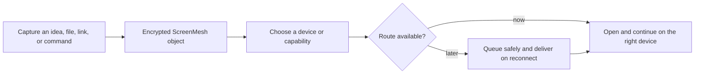

# The ScreenMesh Idea

## The sentence to keep us honest

> ScreenMesh helps a person capture something once, move it privately, and continue it on the device best suited to it.

That is the product. Encryption, QR pairing, WebRTC, relays, queues, and nearby transports are important because they make that promise dependable—not because users should have to think about them all day.

## The problem is not “sharing files”

People already have many ways to send a file. The real friction is the endless collection of tiny cross-device handoffs:

- A link on a phone that belongs on a laptop.
- A terminal command discovered in documentation.
- A screenshot from a test device.
- A paragraph that should become a longer draft on another screen.
- A checklist that makes more sense on a tablet.
- A temporary configuration file for a shared lab desktop.

The usual answer is to choose an unrelated app: message yourself, email yourself, open a drive, sign into an account, find the right conversation, then copy the thing out again.

That is not one workflow. It is a set of workarounds.

## The product model

ScreenMesh makes a trusted set of devices feel like a private workspace rather than a collection of separate islands.

The user thinks in terms of work:

> “Put this on my laptop.”

or:

> “Send this to a device that has a terminal.”

They should not need to decide whether the underlying route is WebRTC, relay, Wi-Fi Direct, or a future native transport.

## Four product surfaces

These sections should remain distinct. Combining them creates an interface that is technically complete but cognitively noisy.

| Surface | Question it answers | Product role |
| --- | --- | --- |
| **Workspace** | What am I working on now? | Capture, send, receive, edit, and continue. |
| **Library** | What exists in my private mesh? | Search, browse, pin, tag, and reopen objects. |
| **Devices** | Where can work go, and what can it do? | Pairing, capability, trust, status, and routes. |
| **Inspect** | What changed, and why? | Transfers, Activity, Mesh, and Security. |

The first three are everyday product surfaces. Inspect is deliberately quieter: valuable when something needs explanation, not the main destination for normal work.

## Objects are the center of the experience

ScreenMesh should not feel like a transfer log with a send box attached. Once an object arrives, it should open into the right working surface.

| Object | Natural experience |
| --- | --- |
| Text / document | Read, edit collaboratively, continue elsewhere. |
| Link | Preview the destination and open on a chosen device. |
| Code | Read in a monospace surface, copy, or continue on a terminal-capable device. |
| Image | Preview, download, show on a tablet or display. |
| File | Name, inspect, download, and hand off. |
| Checklist | Check items from any trusted device. |
| Command | Review, copy, and explicitly approve on a desktop agent. |

That is why Library matters. It turns “things that passed through the mesh” into useful working material.

## Principles for product decisions

### 1. Trustworthy, quiet routing

The default status should be understandable:

- Delivered
- Queued safely
- Waiting for Nidhi’s Laptop
- Needs approval

Route details belong behind a **Why?** explanation in Activity, Transfers, or Mesh. The user should not have to understand networking to trust a handoff.

### 2. Never silently choose for the user

ScreenMesh can suggest a terminal-capable laptop for code, a browser-capable device for a link, or a display for media. It should never silently reroute sensitive work away from the destination the user picked.

### 3. Local-first means useful when disconnected

The local device is where work lives. A network connection makes delivery faster; it should not be the condition for writing, organizing, or safely queuing an object.

### 4. Security is part of the product, not decoration

No account should be required to establish a device identity. A relay should be useful without being trusted with readable content. Revocation and expiry should be honest about their limits: they prevent future access, not copies a trusted device already made.

### 5. Progressive disclosure beats hiding capability

Most people need Workspace, Library, and Devices. Technical users sometimes need transfer state, routing details, and security posture. Both needs are real; the answer is a calm Inspect area, not removing the advanced views.

## A few representative moments

### A link moves from phone to laptop

The user captures a URL, ScreenMesh suggests the laptop because it has a browser, and the user confirms. The laptop opens it. No message thread, personal cloud login, or remembered clipboard history.

### A laptop is asleep

The user sends an image to the laptop. ScreenMesh says **Queued safely**. Nothing needs to be retried manually; delivery resumes when a trusted route returns.

### A shared lab machine

The user pairs a lab desktop into a temporary workspace, sends a repository link and a command, approves the command locally on that desktop, and lets the workspace expire afterward. Their personal account never needs to be signed into the machine.

### A long note becomes work

The user sends long text as a document with an optional title. It appears in Library, opens into a larger collaborative editor, and can be pinned or marked for later without turning into an external cloud document.

## What ScreenMesh is not

It is not a VPN, public publishing platform, anonymous network, permanent cloud drive, or remote-desktop tool. It is also not a permission system that can stop a trusted recipient from copying visible data.

Those boundaries make the product clearer. ScreenMesh is a secure cross-device continuity layer for people and devices that already belong together.

## The test for every feature

Before adding a feature, ask:

> Does this make it easier to capture, move, understand, or continue private work across trusted devices?

If it does not, it is probably a distraction from the core product.
