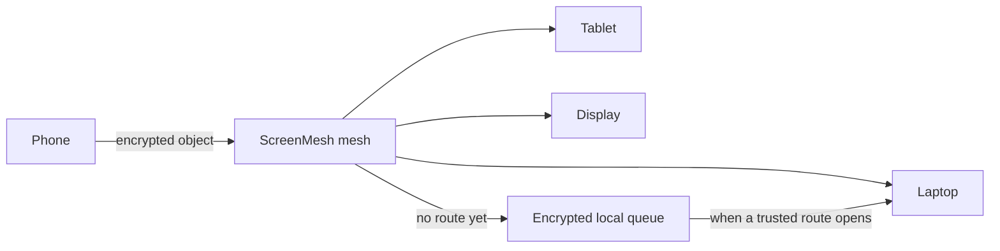
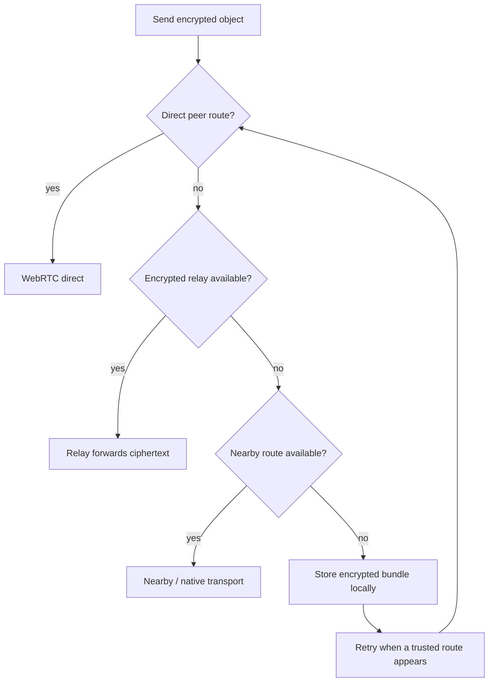

# ScreenMesh

> Your devices should feel like one private workspace.

ScreenMesh is a local-first, end-to-end encrypted device mesh. Pair a phone, laptop, desktop, tablet, or display; then send useful things between them without emailing yourself, logging into a cloud account on a shared machine, or hoping every device is online at the same time.

Send a link from your phone to your laptop. Continue a document on a different screen. Queue a file for a desktop that is asleep. Send a command to a trusted desktop agent for approval. ScreenMesh keeps the delivery mechanics in the background and lets the work stay in front.

## Why it exists

Temporary work is everywhere: a URL, a screenshot, a command, a copied error, a checklist, a file that needs to reach another screen. Today, moving it usually means picking a different app for every situation.

ScreenMesh gives those handoffs one private place to go.



## What you can do

- Pair devices without an account using a QR code or pairing link.
- Send text, documents, links, code, images, files, checklists, clipboard content, commands, and structured agent tasks.
- Send to a specific device, everyone, or a device advertising a capability such as `terminal` or `browser`.
- Keep working with objects after arrival: edit collaborative text/documents, update checklists, copy, download, open, pin, tag, and continue later.
- Queue encrypted objects safely when a target is offline.
- Inspect delivery, routing, device, and security state only when you need to understand what happened.

## Privacy in one minute

ScreenMesh is built for devices you trust.

- Devices have local cryptographic identities; there is no required account.
- Content is encrypted before it leaves the sender.
- Relays can forward encrypted bytes, but are not meant to read object contents.
- Paired devices use signed envelopes, replay protection, and forward-secret per-pair Double Ratchet sessions.
- The workspace owner can revoke a paired device.

Encryption protects content in transit and at the relay. It does not stop a trusted recipient from copying, downloading, photographing, or otherwise saving information they can view. See [FAQ.md](FAQ.md) and [docs/Security.md](docs/Security.md) for the full, honest model.

## How delivery works

ScreenMesh prefers the fastest useful route and falls back gracefully. A user should normally see only **Delivered**, **Queued safely**, or **Waiting for a device**.



The deeper route reasoning remains available in Transfers, Activity, and Mesh rather than constantly taking over the interface.

## Product surfaces

| Surface | What it is for |
| --- | --- |
| **Workspace** | Send objects and handle active work. |
| **Library** | Search the private archive; use recents, pins, tags, and “continue later.” |
| **Devices** | See paired devices, trust, status, and capabilities. |
| **Inspect** | Transfers, Activity, Mesh, and Security—detail when you need it. |

## Repository layout

```text
apps/
  web/       React PWA and local-first workspace UI
  server/    Fastify relay, pairing API, encrypted store-and-forward
  agent/     Approval-gated desktop command and task agent
  android/   Native Android implementation
packages/
  protocol/  Shared object, operation, and envelope types
  crypto/    Identity, ratchet sessions, encryption, signatures
  transport/ WebRTC, relay, and transport abstractions
  sync/      Object sync, delivery, queues, and CRDT integration
  storage/   IndexedDB/Dexie persistence
docs/        Architecture, security, transport, and roadmap details
```

## Run it locally

Requirements: Node.js 20+ and pnpm 9+.

```bash
pnpm install

# Terminal 1: relay and pairing API
pnpm dev:server

# Terminal 2: web app
pnpm dev:web

# Validate the repository
pnpm typecheck
pnpm smoke
```

The web development server is served over HTTPS because browser cryptography requires a secure context. For a second local “device,” open the web app with `?device=2` in another browser window.

## Desktop agent

The browser cannot execute shell commands. The optional desktop agent is a separate local process that uses the same protocol, crypto, sync, and transport packages as the web app.

```bash
pnpm --filter @screenmesh/agent dev -- --join "<join-link>" --name "My Desktop"
```

It advertises a terminal capability. Command and agent-task objects always wait for explicit local approval before execution.

## Read next

- [FAQ](FAQ.md) — product, privacy, and everyday-use questions
- [Product idea](IDEA.md) — the problem, product principles, and experience
- [Future](FUTURE.md) — deliberate product and protocol directions
- [Architecture](docs/Architecture.md) — system design
- [Security](docs/Security.md) — identities, encryption, and threat model
- [Roadmap](docs/Roadmap.md) — shipped work and technical roadmap

## Contributing and security

Contributions are welcome. Please read [CONTRIBUTING.md](CONTRIBUTING.md) for local setup, design principles, and safe reporting practices.

If you believe you found a security vulnerability, do not post secrets or exploit details publicly; follow [SECURITY.md](SECURITY.md).

ScreenMesh is licensed under the [Apache License 2.0](LICENSE).
